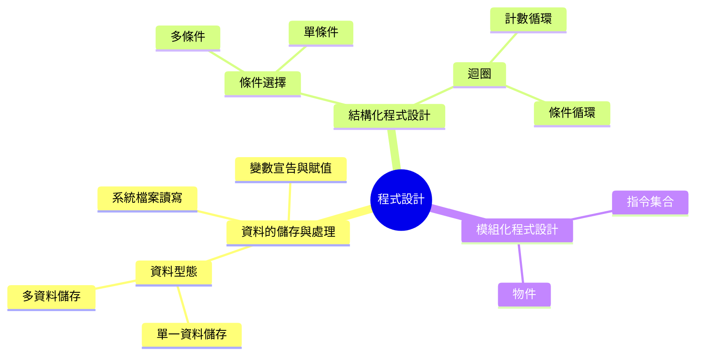

# 程式語言的架構

## 以及我們如何跨語言學習

---

# 程式語言的架構

::div {.h-full .flex .justify-center .items-center}

::

---

::div {.h-full .flex .justify-center .items-center .flex-col .pb-8}
這麼多東西，都會用到嗎？

碰到 **APCS** {.font-mono}，除了「物件」及「系統檔案讀寫」之外，

可能**都需要**{.text-4xl .text-rose-600}用到！
::

---

::div {.h-full .flex .justify-center .items-center .flex-col .gap-4 .pb-8}
但往好方面想，

事實上每一個程式語言都差不多就這些了... 

[( ￣□￣)σ 論破!! ︴≡║██言彈██》]{.font-mono}
::

---

# 如何學好程式語言？

::p {.pl-2 .pt-2 .text-center}
以下重點掌握，其實差不多會一個程式語言了 [(ﾉ◕ヮ◕)ﾉ*:･ﾟ✧]{.font-mono}
::

:::v-clicks
::ul {.pl-24 .pt-2}
* 如何宣告變數。
* 如何把資料存進變數中。
* 變數儲存的資料有哪些資料型態。
* 條件判斷式如何寫。
* 迴圈如何寫。
* 如何宣告函式（**function**{.font-mono}）
::
:::

---
layout: image
---

# 如何學好程式語言？（續）


---

# 進階：如何更精通程式設計？

::div {.h-full .flex .justify-center .items-center .flex-col .gap-4 .pb-8}
沒有什麼好方法，

就是一直探索、一直查詢、一直嘗試。
:::p
::::v-click
然後~~一直被虐、一直看日出~~
::::
:::
::

---

# 進階：如何更精通程式設計？（續）{style="font-size: 3.2rem;"}

一個簡單的例子舉例： {.pt-4 .pl-4}

::div {.kg .font-mono .h-full .flex .justify-center .items-center .pb-6 .-mt-6}
````md magic-move
```py
# 輸入為 `2 3 4 5 6`，要把這些數字相加
nums = input()
nums = nums.split()
result = 0
for num in nums:
    result = result + int(num)
print(result)
```
```py
# 輸入為 `2 3 4 5 6`，要把這些數字相加
nums = input()
nums = nums.split()
result = 0
for num in nums:
    result += int(num)
print(result)
```
```py
# 輸入為 `2 3 4 5 6`，要把這些數字相加
nums = input()
nums = nums.split()
nums = map(int, nums)
result = sum(nums)
print(result)
```
```py
# 輸入為 `2 3 4 5 6`，要把這些數字相加
nums = input()
nums = map(int, nums.split())
result = sum(nums)
print(result)
```
```py
# 輸入為 `2 3 4 5 6`，要把這些數字相加
nums = input()
result = sum(map(int, nums.split()))
print(result)
```
```py
# 輸入為 `2 3 4 5 6`，要把這些數字相加
result = sum(map(int, input().split()))
print(result)
```
```py
# 輸入為 `2 3 4 5 6`，要把這些數字相加
print(sum(map(int, input().split())))
```
````
::

<style scoped>
.kg * {
    font-size: 1.4rem;
    line-height: 2rem;
}
</style>

:::p {.absolute .w-full .text-center .-bottom-2}
::v-click
只要夠熟練，程式是有可能簡化為一行 [(❛◡❛✿)]{.font-mono}

但真心不推薦走火入魔一直練 **One-Liners**{.font-mono}...
::
:::

---

# 進階：如何更精通程式設計？（續）{style="font-size: 3.2rem;"}

::div {.font-mono .px-6 .pt-4}
```py {monaco-run} {autorun: false, height: '16rem', lineNumbers: 'on', editorOptions: { fontSize: 14 }}
"""
你可以試試看剛剛的程式碼
你可以改變 `# stdin: ` 後，雙引號中的資料，看看會發生什麼事。
# stdin: "2 3 4 5 6"
"""
nums = input()
nums = nums.split()
result = 0
for num in nums:
    result = result + int(num)
print(result)
```
::

---

# RECAP {.font-mono}

::v-clicks
:::ul {.pl-16 .pt-6}
* 程式語言的架構不外乎就是：儲存與處理、結構設計、模組設計。
* 不同程式語言，同一種學習架構。
* 只要跟著架構學，沒有學不會的程式語言。
* 要精進某種語言的程式設計能力，就是要一直挖掘該語言的特性。
* 不建議走火入魔練習 **One-Liners**{.font-mono} 技法。
:::
::